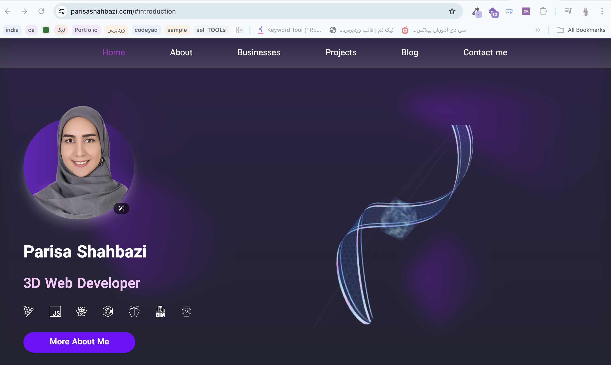

# css-practices

Hello! 👋  

I have **over 3 years of experience** in web development and have successfully completed **more than 10 projects**, all of which can be viewed in my portfolio. Most of the source codes are **private** due to client contracts.  

During my free time, I started this repository to share **public examples and exercises**, especially focusing on **CSS** .  

### 🔹 Core Skills
- **Three.js**: This is my main expertise. Please check my [resume/portfolio](#portfolio) for more professional work samples.  
- **CSS & Frontend**: In this repo, you will find small exercises and examples to learn and practice styling and layout.  

### ✅ Purpose of this Repository
- Share public examples and small practice projects  
- Provide exercises useful for learning **CSS**   

---

### Portfolio
Check out my portfolio to see my full projects and professional work:  
[My Portfolio](https://parisashahbazi.com/#introduction)  

